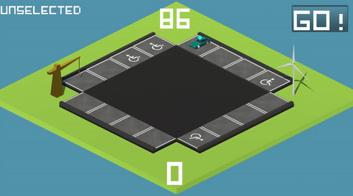

# [Repository](https://github.com/Koltonix/parking-roulette) || [Itchio](https://koltonix.itch.io/parking-roulette)
# Parking Roulette

## Description
A Turn-Based Puzzle Game were you control cars from their current spot to a parking bay.
This was originally a Game Jam Submission, but we are deciding to continue it further.

## Information
- Unity 2018.4.2f1 

## Contributors
|Programmer                                          |Artist                                                       |Artist       |
|----------------------------------------------------|-------------------------------------------------------------|-------------|
|[Christopher Robertson](https://github.com/Koltonix)|[Jamie Vodden](https://www.instagram.com/jamie_vodden/?hl=en)|Tabbie Lawson|
                                            

> Made by Tabbie Lawson

# External Assets Used
- [Pixel-Art Font](https://www.dafont.com/pixel-art.font)
